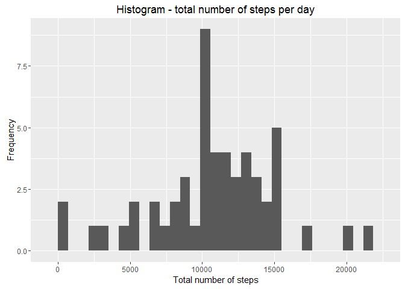
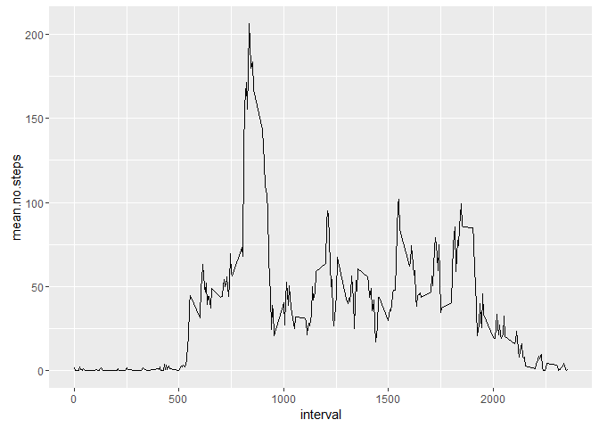
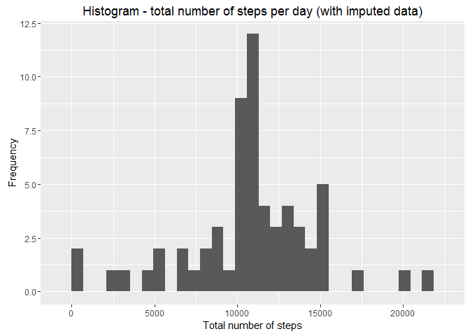
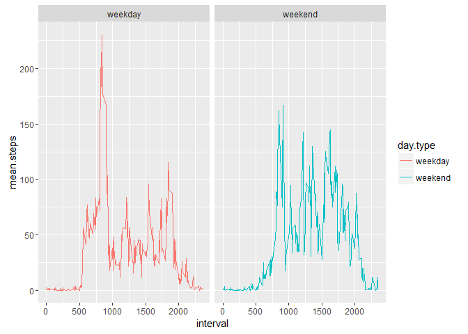

# Reproducible Research: Peer Assessment 1


```r
library(ggplot2)
library(dplyr)
library(knitr)
```

## Loading and preprocessing the data


```r
personal.mov <- read.csv("activity.csv")
```

## What is mean total number of steps taken per day?

```r
num.steps.per.day <- personal.mov %>% group_by(date) %>% summarise(total.no.steps = sum(steps))

ggplot(data=num.steps.per.day, aes(total.no.steps)) + geom_histogram() +
  ggtitle("Histogram - total number of steps per day") +
  xlab("Total number of steps") +
  ylab("Frequency")
```

```
## `stat_bin()` using `bins = 30`. Pick better value with `binwidth`.
```

```
## Warning: Removed 8 rows containing non-finite values (stat_bin).
```



```r
print("Mean and Median values:")
```

```
## [1] "Mean and Median values:"
```

```r
summary(num.steps.per.day$total.no.steps)
```

```
##    Min. 1st Qu.  Median    Mean 3rd Qu.    Max.    NA's 
##      41    8841   10760   10770   13290   21190       8
```

## What is the average daily activity pattern?

```r
num.steps.per.interval <- personal.mov %>% group_by(interval) %>% summarise(mean.no.steps = mean(steps, na.rm=TRUE))

ggplot(data=num.steps.per.interval, aes(x=interval,y=mean.no.steps)) + geom_line()
```



```r
max.interval <- num.steps.per.interval %>% 
                filter(mean.no.steps == max(mean.no.steps)) %>% 
                select(interval)

cat("Interval with max. num. of steps (in average):",max.interval$interval)
```

```
## Interval with max. num. of steps (in average): 835
```

## Imputing missing values

```r
num.nas <- sum(is.na(personal.mov))

get.mean.num.steps.per.interval <- function(steps.per.interval.df, interv) {
  interval.row <- filter(steps.per.interval.df,interval == interv)
  return(as.double(interval.row[1,2]))
}

personal.mov.complete <- personal.mov
personal.mov.complete <- merge(personal.mov,num.steps.per.interval)
personal.mov.complete$steps <- ifelse(is.na(personal.mov.complete$steps),
                            personal.mov.complete$mean.no.steps,
                            personal.mov.complete$steps)

num.steps.per.day2 <- personal.mov.complete %>% group_by(date) %>% summarise(total.no.steps = sum(steps))

ggplot(data=num.steps.per.day2, aes(total.no.steps)) + geom_histogram() +
  ggtitle("Histogram - total number of steps per day (with imputed data)") +
  xlab("Total number of steps") +
  ylab("Frequency")
```

```
## `stat_bin()` using `bins = 30`. Pick better value with `binwidth`.
```



```r
print("Mean and Median values:")
```

```
## [1] "Mean and Median values:"
```

```r
summary(num.steps.per.day2$total.no.steps)
```

```
##    Min. 1st Qu.  Median    Mean 3rd Qu.    Max. 
##      41    9819   10770   10770   12810   21190
```

### Do these values differ from the estimates from the first part of the assignment?

As we can see, the mean value is the same, but the median increased in 10 steps.

### What is the impact of imputing missing data on the estimates of the total daily number of steps?

The height of the histogram for daily total number of steps has increased, as can be seen by the change in the y-axis scale change, as expected. Then, the mean was shifted right.

## Are there differences in activity patterns between weekdays and weekends?

```r
personal.mov.complete$weekday <- weekdays(as.POSIXct(personal.mov.complete$date))
personal.mov.complete$day.type <- as.factor(ifelse(personal.mov.complete$weekday %in% c("Saturday","Sunday"),"weekend","weekday"))

num.steps.per.day.type <- personal.mov.complete %>% group_by(day.type, interval) %>% summarize(mean.steps = mean(steps))

plot <- ggplot(data=num.steps.per.day.type, aes(x=interval,y=mean.steps, colour=day.type)) + geom_line()

plot + facet_grid(. ~ day.type)
```




